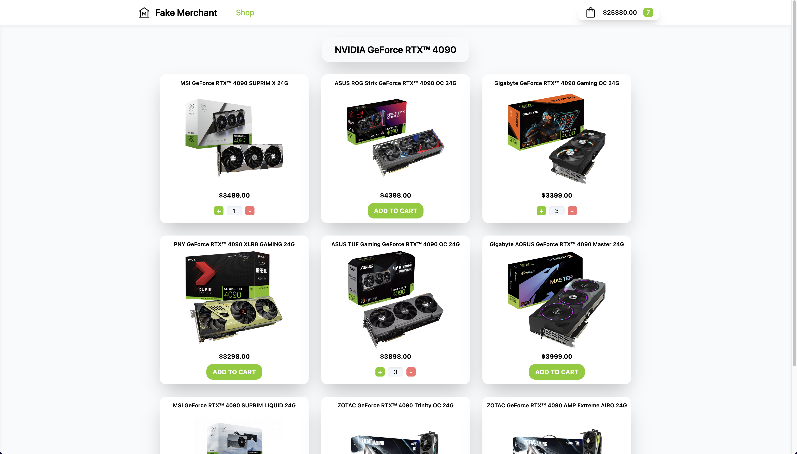

# This is an Online Merchant Storefront with a Functional Cart

This Web App is my shot at building an interactive Online Merchant Storefront with a functional cart as a submission for The Odin Project's Shopping Cart JavaScript Project.

The project was built using React, React-Router, and TailwindCSS.

## Functionality

- Users are greeted by a landing page that introduces the GeForce RTX 4090. Upon clicking the "See all buying options" button, the user will be taken to the storefront page via react-router.

- In the storefront, users can add any amount of the 9 GPU options to their cart. The cart will update with the correct final total and if clicked, will show the breakdown by each GPUs quantity and it's sub-total.

If you want to have a look just press the github-pages button to the right of this README. While you're there feel free to add few horrendously expensive RTX 4090s to your cart (pricing is the cards MSRP in NZD).

